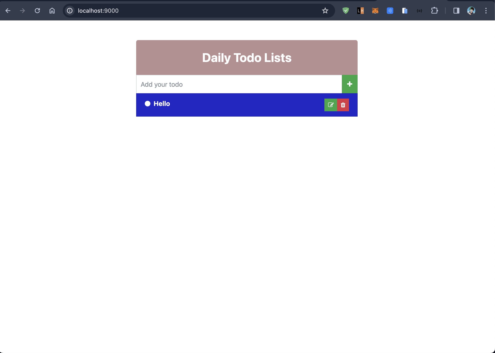

# Go-Lang Todo

This is a full stack todo ap build using golang and HTML(tpl).

- It is an example learning app build using golang

Things I learned:
- How to create a server using Golang.
- How to containerise(using docker) an golang app.
- How to perform CI/CD(using github actions) in Golang.

